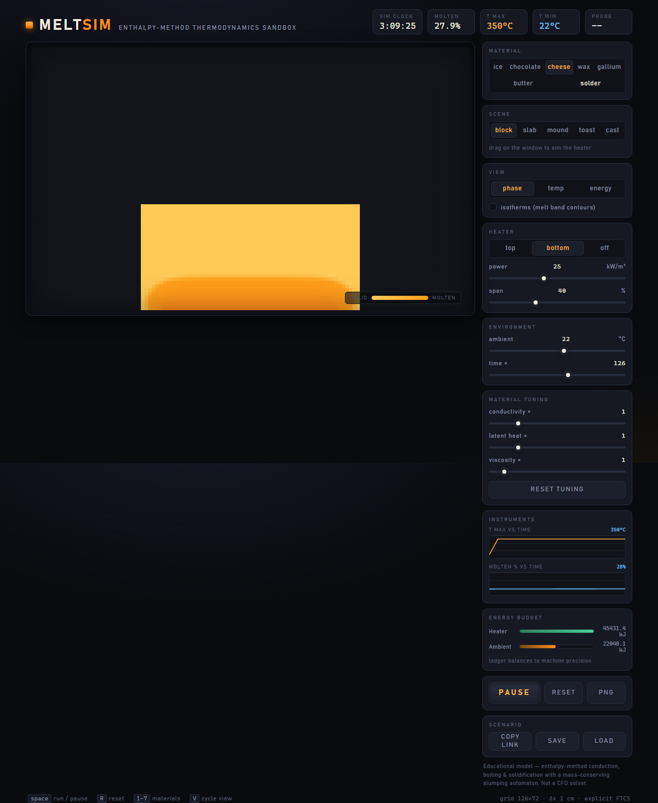

# MeltSim - interactive 2D thermodynamics sandbox

[](https://github.com/GreenPandaTech/MeltSim/actions/workflows/ci.yml)

Melt, **freeze** and **boil** materials in the browser — heat ice, chocolate,
cheese, wax, gallium or solder across their latent-heat plateau and watch them
slump into puddles; pour hot solder into a cold mould and watch it set from the
walls inward; boil water away under a hotplate. It is all driven by a
unit-tested, dependency-free enthalpy-method core. The non-obvious part: there
is no special-cased "melting logic" or "freezing logic". Each cell stores
specific enthalpy rather than temperature, so the latent-heat plateau (energy
pouring in while temperature barely moves), the phase boundary and its motion in
*both* directions fall out of one conservation law — and the same pure core
renders the interactive bench, the instrument charts and the README's
animations.


*Cheese on toast under a grill (3 simulated hours): the cheese crosses its
latent-heat plateau and slumps over a substrate that never melts. Rendered
headlessly by the simulator itself and encoded by the project's own
dependency-free GIF89a encoder.*

> **Honest framing:** MeltSim is an *educational* model. The thermal side uses
> a standard fixed-grid technique (the enthalpy method) with real,
> literature-informed material constants; the *flow* side is a deliberately
> simple mass-conserving automaton, not a Navier–Stokes solver. It teaches the
> qualitative physics of melting; it makes no quantitative accuracy claims.



## Demos

Ice mound in a warm room (12 hours, ambient only — meltwater pools and the mound settles):


Cheese block on a hotplate (4 hours — melt forms at the base and the block sinks into its own puddle):


Chocolate mound on a gentle hotplate (4 hours — collapses into spreading goo):


Cheese on toast (3 hours under a top grill — the cheese melts and flows over
the toast; the toast warms up but never melts or moves):


These strips are generated headlessly by `npm run export:frames` using exactly
the same physics and renderer the interactive bench runs — no hand-tuned
artwork.

### New in 1.0 — solidify, boil, and see the fields

Pour molten solder into a cold steel mould: it fills, then sets from the walls
inward (molten fraction 17% → 0% as it freezes):


Boil a hot water block under a hotplate — it plateaus at 100 °C and loses mass
to vapour:


Gallium slumping on a warm plate, far below the melting point of an ordinary
metal:


The *same* frame in the four field views — material, temperature, phase and
energy:


## Features

- **Bidirectional phase change** — melting *and* freezing fall out of one
  enthalpy conservation law; no special-cased "melting" or "freezing" logic.
- **Seven materials** with distinct thermal + rheological personalities: watery
  ice, gooey chocolate, stiff cheese, runny wax, body-temperature **gallium**,
  **butter** and castable **solder** — plus **toast** and **steel** substrates
  that conduct heat but never melt in-sim.
- **Solidification / casting**: a pour **source** injects hot material over
  time; a cold **mould** (a Dirichlet reservoir of rigid walls) freezes it from
  the walls inward.
- **Boiling** with mass loss — liquids plateau at their boiling point and shed
  mass as vapour; the vented energy is tracked so the budget still closes.
- **Energy ledger**: every joule in (heater, ambient, pour, wall) and out
  (vapour) is accounted, and conservation is asserted to float precision.
- **Field views**: material / temperature / phase / energy false-colour, plus
  **isotherm** contour overlays.
- **Live instruments**: temperature-vs-time and molten-%-vs-time charts and an
  energy-budget HUD, all fed from the same core.
- **Two-material scenes**: heat crosses material boundaries (harmonic-mean
  conduction) and melt flows over substrates without mixing.
- **Interactive bench**: aim a heater by dragging, switch scenes
  (block / slab / mound / toast / cast), tune power, span, ambient and time
  acceleration, and **tune material constants** live (conductivity, latent
  heat, viscosity).
- **Scenarios**: save / load / copy-link the full bench state (tolerant URL +
  JSON round-trip), plus a probe readout and PNG snapshot.
- Headless frame exporter with dependency-free **PNG and animated-GIF
  (GIF89a/LZW) encoders**.
- **219 unit tests** on everything that computes (conservation laws, boiling
  and freezing, phase mapping, stability, automaton, multi-material rules,
  renderer field views, isotherms, charts, scenario round-trips), including
  **one- and two-phase Stefan-problem benchmarks**.

## Run it

```bash
npm install
npm run dev        # interactive bench at http://localhost:5173
npm test           # 219 vitest tests
npm run lint       # ESLint (typescript-eslint)
npm run typecheck  # strict TypeScript
npm run export:frames  # regenerate docs/media/*.png + *.gif headlessly (Node >= 23.6)
```

Keyboard: `space` run/pause · `R` reset · `1–7` switch material · `V` cycle
field view.

URL parameters (e.g. `/?material=cheese&scene=block&side=bottom&warp=10800&autorun`):

| param | values | effect |
|---|---|---|
| `material` | `ice` `chocolate` `cheese` `wax` `gallium` `butter` `solder` | select material (in two-material scenes: the material on top / poured) |
| `scene` | `block` `slab` `mound` `toast` `mould` | initial shape (`mould` = casting) |
| `side` | `top` `bottom` `off` | heater placement |
| `power` | `2`–`60` | heater flux, kW/m² |
| `warp` | seconds | pre-advance the simulation |
| `autorun` | — | start running |

## The physics (and its simplifications)

**Enthalpy method.** Each cell tracks specific enthalpy `h` (J/kg) instead of
temperature, with `h = 0` at the solidus:

```
solid   (T <= Ts):        h = c_s (T - Ts)
mushy   (Ts < T < Tl):    h = phi * L        with  T = Ts + phi (Tl - Ts)
liquid  (T >= Tl):        h = L + c_l (T - Tl)
```

The liquid fraction `phi = h / L` inside the mushy zone gives the latent-heat
plateau for free: energy pours in while temperature barely moves. Sensible
heat inside the mushy zone is folded into the plateau (a documented
simplification).

**Conduction.** Explicit finite-volume FTCS: each face exchanges
`q = k Δt (T_j − T_i) / (ρ Δx²)`, scaled by face contact (partial cells conduct
less, empty faces not at all). Pairwise antisymmetric exchange makes energy
conservation exact to floating point — asserted by tests. The solver
sub-steps at the classic stability bound `Δt ≤ ρ c Δx² / 4k` with a 0.9 safety
factor.

**Heater & ambient.** The heater injects a flux into the first material cell
of each heated column (so it follows the surface as material slumps), hard-
capped at 350 °C. Exposed faces exchange with ambient via a convective
coefficient.

**Boiling.** The enthalpy method has no upper bound on liquid enthalpy, so a
second transition caps it. For materials with a boiling point, any specific
enthalpy above `hBoil = L + c_l (Tboil − Tl)` vaporises mass at the latent heat
of vaporisation: `dm = m (h − hBoil) / L_vap`, the remaining mass is pinned at
the boiling point, and the departing vapour carries its enthalpy away. Applied
every conduction sub-step (so a transiently superheated cell cannot conduct
heat it should have spent on vaporisation), it makes water plateau at 100 °C and
boil dry under a hotplate. The pure `vaporiseCell` conserves energy by
construction (`energy_before == energy_after + vented`), tested to float
precision. Only water carries `Tboil` in the shipped presets.

**Solidification (pour & mould).** Melting's mirror image needs no new phase
logic — the enthalpy map is symmetric — only two mechanisms. A **pour source**
injects fresh material of a chosen temperature into the top of each source
column over time (carrying its enthalpy into the ledger). A **mould** is a
U-shaped shell of rigid, high-melt wall cells clamped to a fixed temperature
each step (a Dirichlet reservoir); the walls rest on the floor so the flow
automaton never leaves them unsupported. Pour hot solder into a cold steel
mould and it freezes from the walls inward. The clamp is an external heat
exchange, so it is booked separately (see the ledger) and the *internal* budget
still closes.

**Energy ledger.** Every joule crossing the domain boundary is accumulated:
`heaterJoules`, `ambientJoules`, `pouredJoules`, `wallJoules` (the mould
reservoir) and `ventedJoules` (boiling). The invariant

```
totalJoules(now) == totalJoules(reset)
                    + heater + ambient + poured + wall − vented
```

holds to float precision and is asserted across the boiling, pour and casting
tests — and surfaced live in the bench's energy-budget HUD.

**Flow.** A mass-conserving cellular automaton, *not* CFD: gravity drops any
unsupported mass (solids fall as rubble); cells blocked from falling creep
sideways toward lower fill at a rate set by liquid fraction (30 % percolation
threshold) and an Arrhenius-style viscosity `μ(T) = μ₀ e^(−β(T−Tl))`. Every
transfer moves the matching enthalpy with the mass, so melt carries its heat
as it flows.

**Two materials.** Each cell carries a material index and stays strictly
single-material. Conduction across a mixed face uses the **harmonic mean**
`2 k_i k_j / (k_i + k_j)` of the two conductivities — the exact
series-resistance value for two half-cells, though it ignores any contact
resistance (a simplification). Because cell state stores fill-weighted
*specific* enthalpy (J/kg), the same face heat `q` updates the two sides as
`+q/(ρ_i Δx²)` and `−q/(ρ_j Δx²)`; the conserved quantity across densities is
therefore **joules** (`totalJoules` sums `E ρ Δx²`), which the tests assert to
float precision. The explicit stability bound is taken as the *minimum* over
every material on the grid. Flow obeys a **same-material-only rule**: mass
moves between cells of one material or into empty cells (which adopt the
mover's index); a cell of another material is a rigid wall and a floor. There
is deliberately no mixing, wetting or displacement between materials — melt
flows *over* the toast, never into it. The toast preset itself is honest
bookkeeping, not new physics: toast is simply a material whose melting band
(200–210 °C) sits far above every demo material's range, so under the shipped
scenes it conducts and warms but never melts. (Aim a max-power grill straight
at it and its surface *can* enter that softening band — the heater clamps at
350 °C — but the full-width slab still has nowhere to flow, so it stays put
regardless.)

**Known simplifications** (all deliberate): 2D; constant density (no
expansion/contraction, so ice ≈ water density here); single conductivity per
material; the mushy zone of ice is an artificial ±0.5 °C band (pure substances
melt at a point, which a fixed grid cannot represent); "melting cheese" is
really fat softening — its latent heat is an *effective* value; no surface
tension, no browning; boiling is modelled as a pure enthalpy cap with mass
loss, not bubble or nucleation dynamics.

**Validation.** The conduction + phase-change core is benchmarked against
the closed-form solution of the one-phase Stefan problem (a wall held at
60 degC melting a 1D column initially at the solidus). The test solves the
transcendental equation for the front constant (lambda = 0.553 at Ste = 0.75)
and checks the simulated melt front against s(t) = 2 lambda sqrt(alpha t):
observed error is 2.8% at t = 500 s falling to 1.9% at t = 2000 s on 1 mm
cells, asserted at < 5% (tests/stefan.test.ts). The residual gap is expected
by construction: the model melts across a 1 degC mushy band, not a sharp
front.

The freezing direction gets its own **two-phase Stefan benchmark**
(tests/stefan_two_phase.test.ts): a superheated liquid against a sub-freezing
wall, so *both* phases are thermally active. The front constant solves the
two-Stefan-number transcendental equation
`St_s/(e^{l^2}erf l) − St_l (c_s/c_l) nu/(e^{(l nu)^2}erfc(l nu)) = l sqrt(pi)`;
the simulated freeze front lands within 8% of analytic (observed 6.1% at
t = 400 s falling to 2.6% at 1500 s, lambda = 0.239), the same mushy-band
transient as the melt benchmark.

## Architecture

```
src/core/       pure, DOM-free, unit-tested physics
  materials.ts  seven presets + substrates + withOverrides (approx. constants)
  enthalpy.ts   h <-> T mapping, liquid fraction, boil threshold
  grid.ts       struct-of-arrays grid (mass, enthalpy, per-cell material)
  heat.ts       explicit conduction (harmonic-mean mixed faces) + stability
  boiling.ts    pure per-cell vaporisation cap (mass loss, conserved)
  viscosity.ts  mu(T) and flow mobility
  flow.ts       gravity + lateral-creep automaton (same-material rule)
  sim.ts        orchestrator: heater, ambient, pour source, mould walls,
                boiling, sub-stepping, the energy ledger and stats
src/render/     pure rasterisers: renderer.ts (material colour) +
                views.ts (temperature/phase/energy fields + isotherms)
src/charts/     pure time-series + SVG polyline + energy-budget geometry
src/scenario/   scenario descriptor <-> URL/JSON + SimConfig assembly
src/png/        dependency-free PNG encoder (DEFLATE is injected)
src/gif/        dependency-free animated GIF89a encoder (own LZW + palette)
src/ui/         thin untested DOM wiring for the bench
scripts/        headless demo exporter (node scripts/export-frames.ts)
tests/          219 vitest tests over everything except src/ui
```

Design rule: everything that computes is pure and tested; the browser layer
only wires sliders to a `Sim` and blits pixels. The README screenshots are
rendered by the same `renderToRGBA` the app uses.

## Safety & privacy

Runs entirely locally (Vite dev server). No network calls, no analytics, no
external assets — the UI uses system fonts. Runtime dependencies: **zero**
(TypeScript/Vite/Vitest are dev-only).

## Roadmap

- WebGL renderer for larger grids (the pure CPU field renderer stays the
  tested reference).
- Buoyant convection within the melt.
- Pseudo-3D height-shaded view.

Done:

- ~~Two-material scenes (cheese on toast: substrate that never melts)~~ — 0.2.0.
- ~~Solidification scenarios (pour hot material into a cold mould)~~ — 1.0.0.
- ~~Boiling cutoff with mass loss above the boiling point~~ — 1.0.0.
- ~~Two-phase Stefan benchmark (superheated liquid AND cold wall)~~ — 1.0.0.

## License

Proprietary, source-available. Copyright (c) 2026 Leo Y. Zhang. All rights
reserved. You may read the source and run it locally to evaluate it; no other
rights are granted. See [LICENSE](LICENSE) for the full terms.
